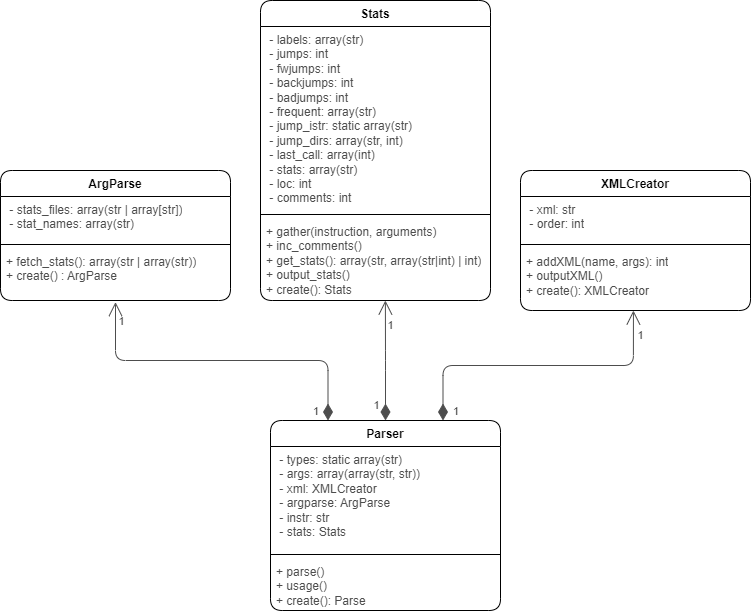

Documentation of Project Implementation for IPP 2022/2023 part I   
Name and surname: Jan Kalenda  
Login: xkalen07  

# Description
A parser implemented in PHP8.1 for the IPPcode23 language. The parser reads the IPPcode23 program from the standard input and outputs the XML representation of the program to the standard output, which can be interpreted by interpret.py script.
The parser also collects statistics about the program and outputs them to the specified files.

# Usage
`parse.php [--help] [--stats=FILE] [--stats FILE] [--fwdjumps] [--backjumps] [--badjumps] [--jumps] [--labels] [--loc] [--comments] [--eol] [--print=STRING] [--print STRING] [--frequent]`  

where:
- `--help` prints the usage of the program
- `--stats` required for other flags, specifies the file where the statistics will be saved to

Statistics flags:
- `--fwdjumps` counts the number of forward jumps
- `--backjumps` counts the number of backward jumps
- `--badjumps` counts the number of invalid jumps (jump to a nonexistent label)
- `--jumps` counts the number of jumps
- `--labels` counts the number of labels
- `--loc` counts the lines of code
- `--comments` counts the comments
- `--eol` prints a newline to the specified stats file
- `--frequent` prints sorted list of the most used instructions
- `--prints` prints the STRING to the specified stats file

### Example usage
`php parse.php --stats=stats.txt --fwdjumps --backjumps --badjumps --jumps --labels --loc --comments --eol --frequent --print="Hello World!"`

# Classes
The program is divided into four distinct classes, each is a singleton.
## ArgParse
- Class used to parse command line arguments
- Arguments are parsed when the object is constructed
- `fetch_stats()` method returns the list of parsed stats arguments
- `create()` instantiates the class and returns the instance

## XMLCreator
- Class used to initiate, manage and output the XML string
- `addXML()` Method that takes the instruction and list of its arguments and adds it to the XML
- `outputXML()` Prints the XML to the standard output
- `create()` instantiates the class and returns the instance

## Stats
- Class collecting statistics about the IPPcode program
- `jump` `call` `return` `jumpifeq` `jumpifneq` are the jump instructions
- bad jump is a jump to a nonexistent label
- `inc_comments()` increments the number of comments
- `gather($instr, $args)` method that takes the instruction and list of its arguments as an associative list and collects the statistics
- `create()` instantiates the class and returns the instance
- `get_stats()` returns the list of statistics
- `output_stats()` prints the statistics to the specified files

## Parser
- Class used to parse a IPPcode23 program
- `parse()` method parses the program and builds up the XML using the XMLCreator class
- `create()` instantiates the class and returns the instance
- `usage()` prints the usage of the program

# Diagram

