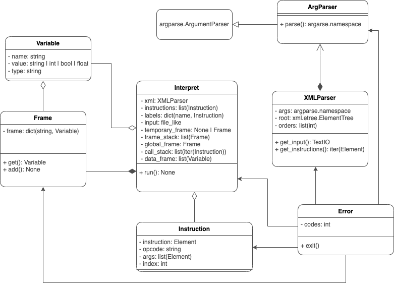

Documentation of Project Implementation for IPP 2022/2023 part II   
Name and surname: Jan Kalenda  
Login: xkalen07  

## 1 Description
Interpret of the XML format of IPPCode23 language. The program is written using Object Oriented Programming. Utilising mostly singleton pattern,
which has been chosen for its simplicity and lesser amount of so-called "boilerplate code". The downside of this approach is that the program relies on singular use of the `Interpret` class, which is not a true singleton, but it is used as one.
An alternative to this design would be to have a singleton maintaining the runtime status of the interpret and using some form of InstructionFactory to create the instructions. This approach would be more flexible, but it would require considerably more "boilerplate code", but would make the program more extensible.


## 2 Usage
```python
python interpret.py [--help] [--source=FILE] [--source FILE] [--input=FILE] [--input FILE]
```

where:
- `--help` prints the usage of the program
- `--source=FILE` or `--source FILE` specifies the XML source file
- `--input=FILE` or `--input FILE` specifies the input file for the program  
Either `--source` or `--input` can be omitted, in which case the standard input is used, but not both.

## 3 Classes
The program is divided into seven distinct classes, each in its own file.

### 3.1 ArgParser
- Class used to parse command line arguments
- The class mimics the design of the `argparse.ArgumentParser` class and as such also acts as a singleton
- The class inherits from the `argparse.ArgumentParser` class and modifies the exit method to exit with a specific error code
- Arguments are parsed using the `argparse.ArgumentParser` class
- `parse()` method returns the namespace of parsed arguments

### 3.2 XMLParser
- Class used to parse the XML source file
- Acting as a singleton, the class is used to parse the XML source file and return the instructions
- The XML validation is done using the `xml.etree` module
- after the initial validation, the XML is checked once again to make sure it is in the correct format 
- `get_input()` Method returns the input file specified by the command line arguments or the standard input
- `get_instructions()` Method returns the iterator over the instructions in the XML file

### 3.3 Instruction
- Class used to represent a single instruction
- The class is used to store the instruction type, arguments and order in the program
- An instance of this class is created for each instruction in the XML file

### 3.4 Variable
- Class used to represent a single variable
- The class is used to store the variable name, value and type
- The instance of this class is created every time a new variable is created or any value is being used in an instruction

### 3.5 Frame
- Class used to represent a single data frame (local, global, temporary)
- The class is used to store the variables in the frame
- `add()` Method adds a new variable to the frame, if the variable already exists, exits with an error
- `get()` Method returns the variable, if the variable does not exist, exits with an error

### 3.6 Interpret
- Class used to interpret the instructions
- The class holds the data frames, labels and stacks
- The class acts as the central singleton and is used to interpret the instructions
- Due to the limitations of Python, the class is not a true singleton, but it is used as one
- The singleton pattern was used to avoid passing the instance of the class to each instruction and as such all the implemented instructions are methods of the class
- `run()` Method runs the program by iterating over the instructions and calling the appropriate method for each instruction

### 3.7 Error
- Class used to represent an error
- The class inherits from the `IntEnum` class and represents the error codes
- The class is used to exit the program with the appropriate error code
- `exit()` Method exits the program with the specified error code and message

## 4 Extensions
The program supports the following extensions:
 - `FLOAT`, where the full support for floating point numbers was added
 - `STACK`, where the specified stack instructions were implemented. The stack is implemented as a simple list, where the top of the stack is the last element of the list. This stack is being held by the `Interpret` class and is used by any instruction that requires it.

## 5 Diagram


